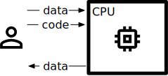

Basic concepts
==============

PPU has quite a diffent programming model than CPU/GPU, this guide introduces the basic concepts.

Machine model
-------------

In normal CPU model, we could treat the machine as a *arithmetic blackbox*, which accepts user *code* and *data*, run the computation, and return result *data* to user. If we draw a picture to show the relationship of user and machine, it's something like this.

In PPU, the first notable difference is that, *input* is not provided by a single user, it's from **multiple parties**, and the *code* could be provided by a separate party, finally, the output could be received by another party. So **PPU is born to be used in a distributed context**. It's looks like:

If we take a closer look, PPU itself is not a physical machine, it is hosted by multiple parties that doest trust on each other. For example, in the following picture, we have three parties (red, blue and green) works together with some MPC protocol, and provide computation service as a **virtual machine**.

So we have treat PPU as a (multi-party visualized) **secure arithmetic blackbox**, which can evaluate computation securely.

API level
---------

With the above VM model, the next question is **how to program on it**? Should we write c++, or python, or something like PPU assembly, the answer is all.

PPU provides multi-level API, from upper to lower:

- **Frontend API** (like tensorflow/JAX), PPU compiles them to PPU IR before run.
- **PPU IR**, an Immediate Representation format defined by PPU, which is not quite readable but easier for computer to understand.
- **C++ API**, which could directly access the underline MPC protocols.

The API hierarchy looks like:

.. important::
   One important goal of PPU is to let people write secure program with their familar framework, so it's recommanded to use Frontend API.

   Currently, only JAX frontend is supported for now.
