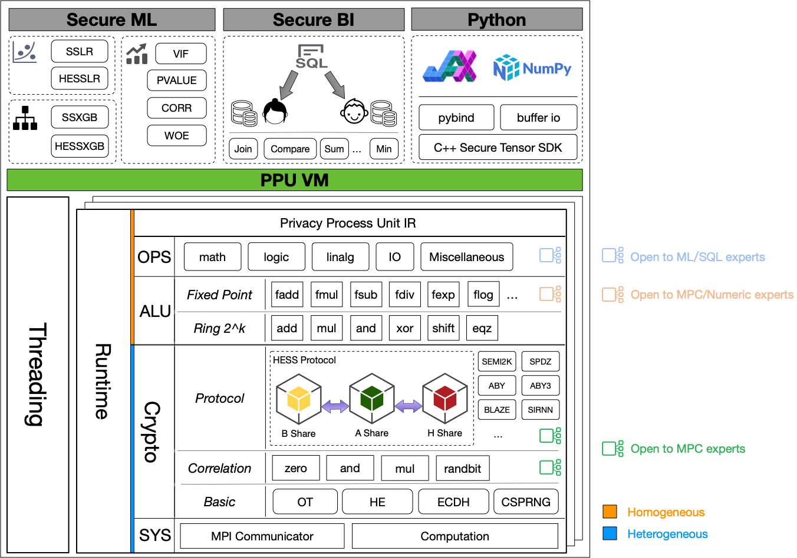
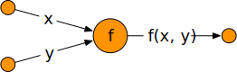

PPU VM Architecture
===================

.. contents:: Table of Contents
    :depth: 5
    :local:
    :backlinks: top

Overview
--------

Here is the big picture of PPU VM.

In this picture:

- The top 3 blocks above *PPU VM* are applications, we could ignore them for now.
- The bottom left block is the scheduling component.
- The main block is the PPU Architecture, which is the core for secure evaluation.

Inside PPU, there are multiple layers, from bottom to up:

- **System layer** provides the basic computation and communication ability for upper layers.
- **Crypto layer** is the key for secure computation, it's composed by 3 sub layers.

  - **Basic** or classic layer, provides classic cryptography, OT, HE also lives in this layer.
  - **Correlation** or the offline protocol layer, provides correlation like beaver triple and randbit.
  - **Protocol** or the online protocol layer, applies random correlation and runs the secure evaluation.

- **ALU layer** converts MPC protocols into a programmable machine, which has two sub layers.

  - **Ring 2^k** layer, just like normal CPU, hides cryptography layer's details and provides standard ring2k arithmetic.
  - **Fixed point** layer use fixed point encoding to represent fractional number and provides basic arithmetic operations over them.

- **OPS layer** is designed to be extensible, in this layer we can define multiple modules based on *ALU layer* and finally exposed to VM clients via bindings or PPU IR.

Homogeneous and Heterogeneous
-----------------------------

Recall that PPU VM is composed of multiple (compute) engines, the definition of *homogeneous* and *heterogeneous* comes from *engines*' perspective.

- **Homogeneous**: a layer is *homogeneous* means that all engines run exactly the same code in this layer. The user of this layer don't have to distinguish between engines, they cannot and should not send/recv messages between engines, in other words, they can treat all engines the same, and programming them as one machine.
- **Heterogeneous**: in contrast, a layer is *heterogeneous* means that engines in this layer behave differently (follow some protocols). The author of this layer should take care of each engines behavior to make things correct.

We want PPU VM to be *homogeneous*, so we can program treat as a normal virtual device when apply secure evaluation. For example, in the following computation graph, given `x`, `y`, we want to compute `f(x, y)`, the big circle represent a compute node which can evaluate f.

.. image:: ../imgs/physical_eval.svg

In secure computation mode, we have a group of servers working together to provide functionality of `f`, as shown blow.

The secure protocol (MPC protocol) itself is **heterogeneous**, three servers in side the big circle may behave differently, in this pic, the lower part is blue, which means three servers acts and interacts differently.

But they together provides a **homogeneous** interface to upper layer, in this pic, the upper half is orange, three servers behave exactly the same, so in the whole computation DAG, the big circle could be treated as one (virtual) node.

Another reason to use **homogeneous** IR is to hide the number of parties, so the application can switch to m-PC protocol from n-PC protocol without code change.

One of *PPU*'s goal is to hide the heterogeneous part and expose homogeneous API.

Layers
------
TODO: describe the design trade-off of each layer.
