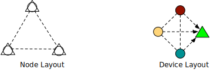

PPU VM Layout
==============

.. contents:: Table of Contents
    :depth: 5
    :local:
    :backlinks: top

Overview
--------

PPU, as a virtual device, is hosted by multiple physical device. The relationship between physical device and PPU is very flexible. How lets use some examples to illustrate the possible layouts.

.. important::
   Programmers coding toward the virtual layout, the underline physical is **transparent** from programmer's perspective. It's free to use different physical layout, without changing a line of code.

Outsourcing
----------------

In this mode, data providers send data shares to a group of non-colluding compute providers, compute provider cooperate to evaluate secure computation.

.. image:: ../imgs/device/outsourcing.svg

The figure to left depicts the physical layout, there are 6 physical nodes, mutually connected but untrusted to each other.

* Circle stands for data provider.
* Triangle stands for compute provider, three triangle node agree on some MPC protocol.

The figure to the right depicts the virtual layout.

* Circle has one-to-one relation to the physical nodes.
* 3 triangle node is treated as single virtual device.

Colocated
---------

In this mode, data providers also participate in the computation progress, that is, data provider **colocated** with compute provider.

* On the left side, there are 3 physical nodes, each of which acts as data provider as well as compute provider.
* On the right side, **PPU is a pure virtual node, constructed by physical nodes**.

Compute node could be more than data node in this mode, for example, the compute node without data source could acts as *random correlation generator*, for example:

.. image:: ../imgs/device/server_aided.svg

|

There two notable optimization in this mode.

- The **private semantic**, compute node may have private data, and private may help to accelerate MPC computation, for example, in *HESS protocol*, we can do :code:`HShare x Private` without online communication.
- The **zero share data infeed**, when data provider tries to share data cross nodes, it can use :code:`ZeroShare + Private` trick to avoid online communication.

Hybrid
------

The most general form, some data provider participate in the secure computation while others not. 

.. image:: ../imgs/device/hybrid.svg

.. note::
  the **private semantic** and **zero share data infeed** also applies for data providers that participate in the computation.

